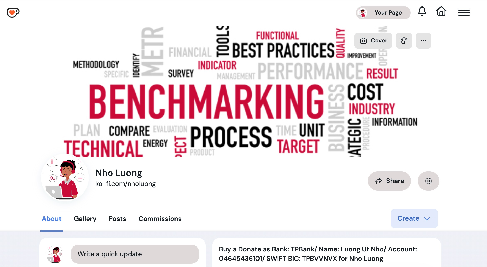

# Build and Release Confidently with Continuous Integration and Delivery

### [View all Roadmaps](https://github.com/nholuongut/all-roadmaps)  ·  [Best Practices](https://github.com/nholuongut/all-roadmaps/blob/main/public/best-practices/)  ·  [Questions](https://www.linkedin.com/in/nholuong/)
 

Continuous Integration (CI) and Continuous Delivery (CD) are the Holy Grail for software development teams: no matter who pushes the feature, the same tests are run, the same processes are followed, and nothing gets released without satisfying well-defined quality standards.

Unfortunately, setting up that initial CI/CD workflow can be a bit daunting for teams that don’t have an experienced DevOps engineer.

Fear not, my dear developers! This talk breaks down the basic concepts of continuous integration, continuous delivery, and how to integrate them into your team’s workflow. Whether you’re working on a small side project or your next big idea, CI and CD can make the journey better.

For this talk, we’ll be using GitLab’s (free) CI/CD pipelines, but the principles translate well to any major CI/CD platform!

:sparkles: **[View slides](cicd-introduction.pdf)**

# 🚀 I'm are always open to your feedback.  Please contact as bellow information:
### [Contact ]
* [Name: nho Luong]
* [Skype](luongutnho_skype)
* [Github](https://github.com/nholuongut/)
* [Linkedin](https://www.linkedin.com/in/nholuong/)
* [Email Address](luongutnho@hotmail.com)

# License
* Nho Luong (c). All Rights Reserved.🌟

